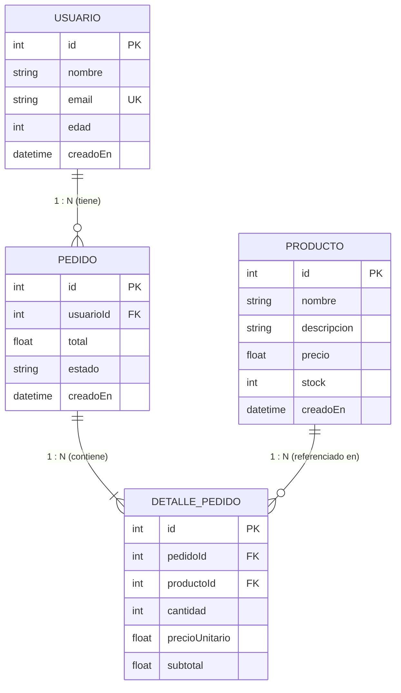

# Walkthrough: Modelado Relacional con Prisma ORM y Migración a PostgreSQL

Se ha definido el esquema relacional completo en `prisma/schema.prisma` para las entidades **Usuario**, **Producto**, **Pedido** y **DetallePedido**, configurando sus claves primarias, atributos de precio y stock, y las relaciones Uno a Muchos (1:N) con claves foráneas. Las migraciones han sido ejecutadas satisfactoriamente en el motor **PostgreSQL**.

---

## 🏛️ Modelo de Datos y Relaciones (1:N)



---

## 📦 Archivos Creados y Modificados

### 1. Esquema Prisma ([prisma/schema.prisma](file:///home/lautaro/Escritorio/Clases/Segundo%20A%C3%B1o/Programacion%20Backend%20/Repos/EjercicioN1-ProgramacionBackend/prisma/schema.prisma))
- **`Usuario`**: `@id @default(autoincrement())`, `email @unique`, relación `pedidos Pedido[]`. Mapeado a la tabla `usuarios`.
- **`Producto`**: `@id @default(autoincrement())`, atributos de `precio` (`Float`) y `stock` (`Int`), relación `detalles DetallePedido[]`. Mapeado a la tabla `productos`.
- **`Pedido`**: `@id @default(autoincrement())`, `usuarioId` con `@relation(fields: [usuarioId], references: [id], onDelete: Cascade)`. Mapeado a la tabla `pedidos`.
- **`DetallePedido`**: `@id @default(autoincrement())`, `pedidoId` con `@relation(fields: [pedidoId], references: [id], onDelete: Cascade)` y `productoId` con `@relation(fields: [productoId], references: [id], onDelete: Restrict)`. Mapeado a la tabla `detalles_pedidos`.

### 2. Entidades de Dominio TypeScript
- [src/entities/pedido.entity.ts](file:///home/lautaro/Escritorio/Clases/Segundo%20A%C3%B1o/Programacion%20Backend%20/Repos/EjercicioN1-ProgramacionBackend/src/entities/pedido.entity.ts): Clase `Pedido` e interfaz `IPedido`.
- [src/entities/detalle-pedido.entity.ts](file:///home/lautaro/Escritorio/Clases/Segundo%20A%C3%B1o/Programacion%20Backend%20/Repos/EjercicioN1-ProgramacionBackend/src/entities/detalle-pedido.entity.ts): Clase `DetallePedido` e interfaz `IDetallePedido`.

### 3. Migración en PostgreSQL
- Se aplicó la migración:
  ```bash
  npx prisma migrate dev --name init_modelos_relacionales
  ```
- Generó el archivo de migración SQL en `prisma/migrations/20260908210229_init_modelos_relacionales/migration.sql`.

---

## 🔍 Verificación en PostgreSQL

Ejecutando la inspección directa sobre la base de datos `ejercicio_backend`:

### Tablas creadas:
```text
 Schema |        Name        | Type  |  Owner   
--------+--------------------+-------+----------
 public | _prisma_migrations | table | postgres
 public | detalles_pedidos   | table | postgres
 public | pedidos            | table | postgres
 public | productos          | table | postgres
 public | usuarios           | table | postgres
```

### Restricciones de Claves Foráneas (Foreign Keys):
- `detalles_pedidos`:
  - `detalles_pedidos_pedido_id_fkey` -> `pedidos(id) ON DELETE CASCADE`
  - `detalles_pedidos_producto_id_fkey` -> `productos(id) ON DELETE RESTRICT`
- `pedidos`:
  - `pedidos_usuario_id_fkey` -> `usuarios(id) ON DELETE CASCADE`

---

## 🧪 Pruebas y Compilación

| Paso | Comando | Estado |
| :--- | :--- | :--- |
| **Migración** | `npx prisma migrate dev` | Exitoso |
| **Generación de Cliente** | `npx prisma generate` | Exitoso |
| **Compilación TypeScript** | `npm run build` | Exitoso (0 errores) |
| **Suite Completa** | `npm test` | **68/68 tests pasados** |
