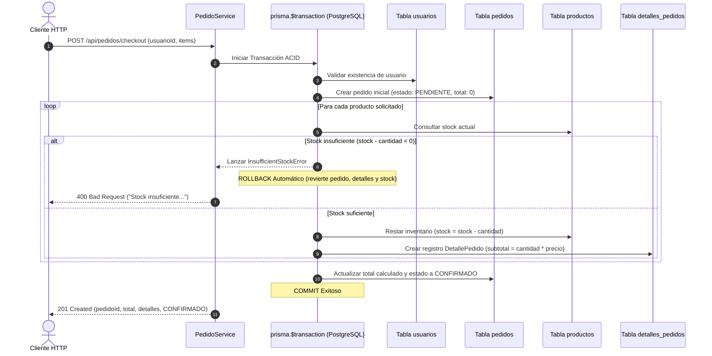

# Walkthrough: Flujo de Checkout Transaccional con Prisma ORM (ACID)

Se ha implementado en la capa `Service` el flujo completo para procesar un **checkout de compras** garantizando las propiedades **ACID** mediante una transacción interactiva con `prisma.$transaction`.

---

## ⚙️ Arquitectura del Flujo Transaccional



---

## 📦 Componentes Implementados

### 1. Error de Dominio ([src/services/errors/app.errors.ts](file:///home/lautaro/Escritorio/Clases/Segundo%20A%C3%B1o/Programacion%20Backend%20/Repos/EjercicioN1-ProgramacionBackend/src/services/errors/app.errors.ts))
- Se definió `InsufficientStockError` heredando de `AppError` con código de estado HTTP `400`.

### 2. DTOs de Pedido ([src/dtos/pedido.dto.ts](file:///home/lautaro/Escritorio/Clases/Segundo%20A%C3%B1o/Programacion%20Backend%20/Repos/EjercicioN1-ProgramacionBackend/src/dtos/pedido.dto.ts))
- `CheckoutItemDTO`: `{ productoId: number; cantidad: number }`
- `CheckoutDTO`: `{ usuarioId: number; items: CheckoutItemDTO[] }`
- `CheckoutResponseDTO`: estructura consolidada con ID de pedido, total, estado `CONFIRMADO` y array de detalles.

### 3. Servicio de Checkout ([src/services/pedido.service.ts](file:///home/lautaro/Escritorio/Clases/Segundo%20A%C3%B1o/Programacion%20Backend%20/Repos/EjercicioN1-ProgramacionBackend/src/services/pedido.service.ts))
- Método `procesarCheckout(dto: CheckoutDTO)` ejecutado dentro de:
  ```typescript
  return await this.prisma.$transaction(async (tx) => {
    // 1. Validar usuario existente
    // 2. Crear pedido inicial en estado PENDIENTE
    // 3. Iterar items, verificar stock >= cantidad
    //    Si stock < 0 -> throw new InsufficientStockError(...) [ROLLBACK]
    //    Resta inventario: tx.producto.update({ data: { stock: stockRestante } })
    //    Crea detalle: tx.detallePedido.create(...)
    // 4. Actualizar pedido con total acumulado y estado CONFIRMADO [COMMIT]
  });
  ```

### 4. Controlador y Rutas HTTP
- [src/controllers/pedido.controller.ts](file:///home/lautaro/Escritorio/Clases/Segundo%20A%C3%B1o/Programacion%20Backend%20/Repos/EjercicioN1-ProgramacionBackend/src/controllers/pedido.controller.ts): método `checkout` con respuestas tipadas y captura en middleware de errores.
- [src/routes/pedido.router.ts](file:///home/lautaro/Escritorio/Clases/Segundo%20A%C3%B1o/Programacion%20Backend%20/Repos/EjercicioN1-ProgramacionBackend/src/routes/pedido.router.ts): ruta `POST /checkout` montada en `/api/pedidos`.
- [src/routes/index.ts](file:///home/lautaro/Escritorio/Clases/Segundo%20A%C3%B1o/Programacion%20Backend%20/Repos/EjercicioN1-ProgramacionBackend/src/routes/index.ts): integrado en el enrutador principal de la API.

---

## 🧪 Pruebas de Integración y Verificación ACID

Se creó la suite [tests/integration/checkout.transaction.test.ts](file:///home/lautaro/Escritorio/Clases/Segundo%20A%C3%B1o/Programacion%20Backend%20/Repos/EjercicioN1-ProgramacionBackend/tests/integration/checkout.transaction.test.ts) ejecutada directamente contra PostgreSQL:

1. **Escenario de Éxito (COMMIT)**:
   - Se procesó un pedido con 2 productos.
   - El stock se decrementó exactamente en PostgreSQL (`10 -> 8` y `5 -> 2`).
   - El pedido se persistió con estado `CONFIRMADO` y total exacto `160.0`.
   - Se crearon los 2 registros de `detalles_pedidos` vinculados.

2. **Escenario de Validación Crítica (ROLLBACK)**:
   - Se intentó comprar más unidades de las existentes.
   - Se lanzó `InsufficientStockError`.
   - **Verificación de Integridad ACID**:
     - El stock de ningún producto fue alterado (ni siquiera del que se evaluó primero).
     - No se insertó ningún registro de pedido ni detalle huérfano.

3. **Verificación de Endpoints HTTP**:
   - `POST /api/pedidos/checkout` respondió `201 Created` ante solicitud válida.
   - `POST /api/pedidos/checkout` respondió `400 Bad Request` con mensaje descriptivo ante stock insuficiente.

---

## 📊 Estado de la Suite Completa

- **Compilación TypeScript (`npm run build`)**: Exitosa (0 errores).
- **Ejecución Global de Tests (`npm test`)**: **79/79 pruebas pasadas** en 8 archivos de test.
